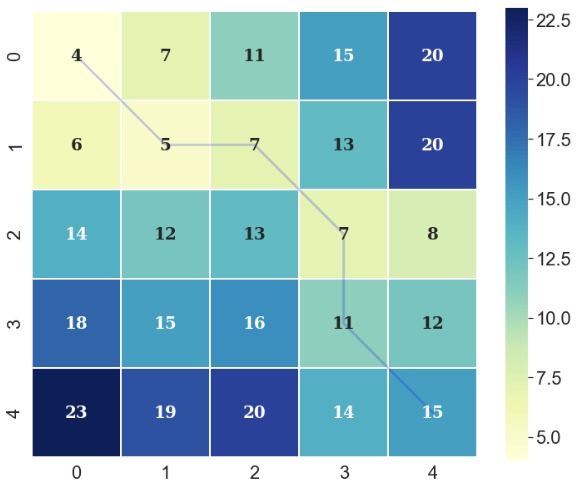
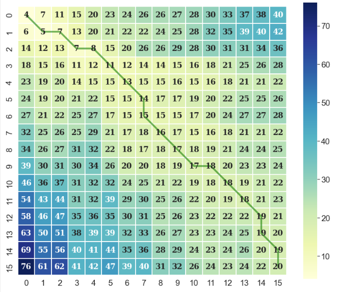
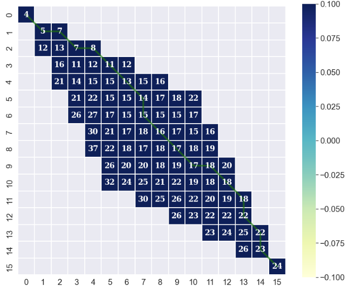
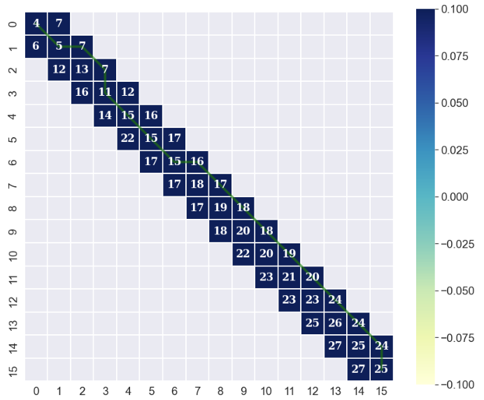
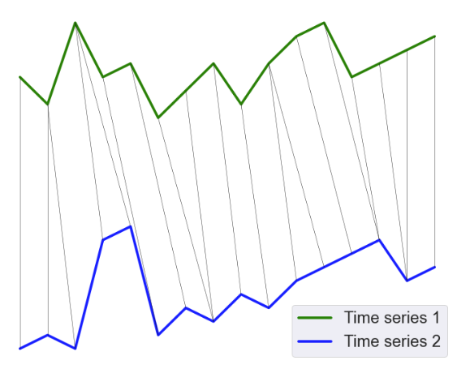
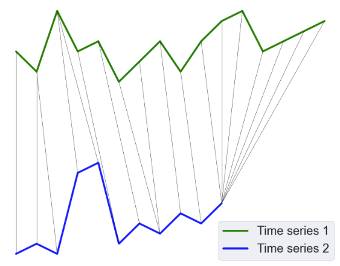
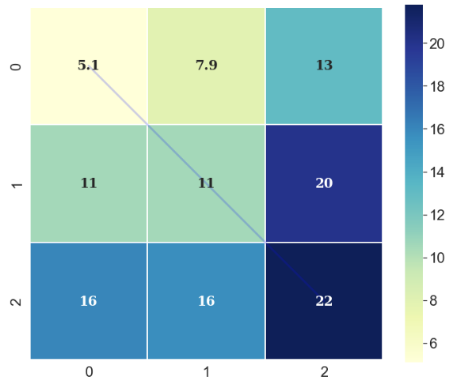
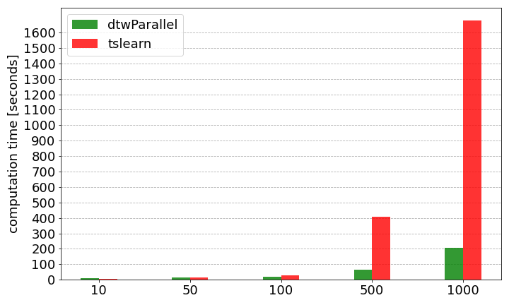

# Dynamic Time Warping 

This package allows to measurement of the similarity between two-time sequences, i.e., it finds the optimal alignment between two time-dependent sequences. It allows working with univariate (UTS) and multivariate (MTS) time series, regular (same time length), or irregular (different time length). 

One of the parameters available for this method is the method used to calculate the local similarity. For this case, it is possible to use any distance available in `scipy.spatial.distance` (it does not allow to work with variables of different nature, i.e., discrete, continuous, and categorical), `gower` distance (it allows to work with variables of different nature). 

At this point, using local dissimilarities such as norm1, norm2, or square euclidean distance provides optimization in terms of computational time with respect to the rest of the available local dissimilarities.

The available variants of DTW are detailed below: 
1) dependent DTW ("d").
2) Independent DTW ("i").

We can set the following global constraints:
1) Itakura parallelogram.
2) Sakoe-Chiba band.
3) None.

Extra functionality has been incorporated to transform the resulting DTW matrix into an exponential kernel, given the sigma value (default 1).

Display for 2-time series (TS):
- It incorporates the possibility of visualizing the cost matrix, the optimal path to reach the DTW distance value between two TS, and the alignment between two TS. This will allow its use in a didactic way, providing a better understanding of the method used.

Common functionalities for N (> 2) time series (TS):
- The calculation can be parallelized by the CPU by selecting the number of threads. As a result, we will obtain the distance matrix. 
- It is possible to perform distance computation and similarity computation (based on an exponential kernel).

 The input data types via API are (1) CSV; (2) array; (3) pandas (pd.DataFrame or pd.Series) and (4) npy (for tensors).

## Table of content 

| Section | Description |
|-|-|
| [Installation](#installation) | Installing the dependencies and dtwParallel |
| [Getting started](#requirements) | Packages necessary to work with dtwParallel |
| [Available parameters](#parameters) | Modifiable parameters in terminal and API with their possible values |
| [Usage](#usage) | Different examples for terminal and API |
| [Configuration](#configuration) | Composition of configuration.ini file |
| [Examples with public data](#realexamples) | Examples with real financial data |
| [References](#reference) | References to cite |
| [License](#license) | Package license |
 

## Package structure 

<p align="center">  </p>

 <!-- <p align="center">  </p> -->


## Installation

dtwParallel can be installed using [pip](https://pip.pypa.io/en/stable/), a tool
for installing Python packages. To do it, run the following command:
```
pip install dtwParallel
```

Current version: 0.9.30


## Requirements

dtwParallel requires Python >= 3.6.1 or later to run. For other Python
dependencies, please check the `pyproject.toml` file included
on this repository.


Note that you should have also the following packages installed in your system:
- numpy
- pandas
- matplotlib
- seaborn
- gower
- setuptools
- scipy
- joblib
- numba

## Available parameters

The different parameters available with their possible values are listed below:

| Parameter description | Terminal usage | API usage | Possible values |
|-|-|-|-|
| Check errors | -ce or --check_errors | check_errors | True or False |
| Type of DTW variant | -t or --type_dtw| type_dtw | "d" or "i" |
| Global constraint | -c or --constrained_path_search | constrained_path_search | "itakura", "sakoe_chiba" or None |
| Local dissimilarity value | -d or --local_dissimilarity | local_dissimilarity | any distance available in `scipy.spatial.distance`, "norm1", "norm2", "gower" or "square_euclidean_distance" |
| Time series introduced: univariate or multivariate | MTS | MTS | True or False |
| Value used to complete irregular MTS. This value is removed transparently to the user | -rf or --regular_flag | regular_flag | int |
| Number of threads used for multiple MTS parallelization | -n or --n_threads| n_threads | int |
| Visualization | -vis or --visualization | get_visualization | True or False |
| Obtain the result in a file | -of or --output_file | not possible | True or False |
| Name for the output file | -nf or --name_file| not possible | string |
| Transformation of the DTW distance matrix to an exponential kernel | -k or --dtw_to_kernel | dtw_to_kernel | True or False |
| Sigma value for kernel transformation | -s or --sigma_kernel | sigma_kernel | float |
| Maximum slope for the Itakura parallelogram | -imx or --itakura_max_slope | itakura_max_slope | float or None |
| Radius to be used for Sakoe-Chiba band | -scr or --sakoe_chiba_radius | sakoe_chiba_radius | int or None |


## Usage

Based on the previous scheme, this package can be used in three different contexts: 

### 1) Calculation of the DTW distance with input from the terminal.
   
   The generic example is shown below:
      
      dtwParallel -x <floats> -y <floats> -d <str> -ce <bool> -of <bool>
      
   Note that only the x and y values need to be set. If not indicated, the rest of the values will be selected from the file containing the default values, ``configuration.ini``.

   Next, different uses are shown by modifying the parameters of the function:
   
   **a) Example 1.** Considers the Euclidean distance, activates the option -ce to check for errors, and uses as input two UTS (denoted as x and y) with the same length (T=10). 
   Firstly, the input TS and distance are checked as valid entries. Secondly, the dtwParallel package computes the DTW distance. Thirdly, the output is shown in the terminal (while in most cases, the outputs are forwarded to a file, we selected this option to facilitate exposition).
   
   ```
   dtwParallel -x 2 4 6 8 5 3 6 8 9 15 -y 12 0 0 3 5 6 30 1 2 4 -ce True

   ```
   ```
   [out]: 65.0
   ```

   **b) Example 2.** Considering the CityBlock distance.
   
   ```
   dtwParallel -x 2.5 4.3 6.6 8.0 1 0 0 1 5.5 15.2  -y 12.1 0 0 1 1 6.4 3.5 1 0 0  -d cityblock
   ```
   ```
   [out]: 45.4
   ```

   **c) Example 3.** This examples are, respectively, counterparts to **Example 1** and **Example 2**.
   
   ```
   dtwParallel -x 2 4 6 8 5 3 -y 12 0 0 3 5 6 30 1 2 4
   ```
   ```
   [out]: 44.0
   ```   
   ```
   dtwParallel -x 2.5 4.3 6.6 8.0 1 0 0 1 5.5 15.2 -y 1 0 0 1 -d cityblock
   ```
   ```
   [out]: 36.09
   ```   

   **d) Example 4.** **Novelty**: It has been included the possibility to calculate the Itakura parallelogram and the Sakoe-Chiba band.
   
   ```
   dtwParallel -x 2 4 6 8 1 0 0 1 5 15 -y 1 0 0 1 -c "sakoe_chiba" -d "square_euclidean_distance"
   ```
   ```
   [out]: 296.0
   ```   
   ```
   dtwParallel -x 2 4 6 8 1 0 0 1 5 15 -y 1 0 0 1 2 4 7 1 9 10 -c "itakura" -d "square_euclidean_distance"
   ```
   ```
   [out]: 169.0
   ```   

   **e) Example e.** **Novelty**: A straightforward and optimal way to calculate norm 1, norm 2 and square euclidean distance is included.

   ```
   dtwParallel -x 2 4 6 8 1 0 0 1 5 15 -y 1 0 0 1 5 6 1 0 9 11 -d "norm1"
   ```
   ```
   [out]: 12.24
   ```   
   ```
   dtwParallel -x 2 4 6 8 1 0 0 1 5 15 -y 1 0 0 1 5 6 1 0 9 11 -d "norm2"
   ```
   ```
   [out]: 18.0
   ```   
   ```
   dtwParallel -x 2 4 6 8 1 0 0 1 5 15 -y 1 0 0 1 5 6 1 0 9 11 -d "square_euclidean_distance"
   ```
   ```
   [out]: 48.0
   ```   
   **We include another example with differents lengths of the time series:**
   ```
   dtwParallel -x 2 4 6 8 1 0 0 -y 1 0 0 1 5 6 1 0 9 11 -d "norm1"
   ```
   ```
   [out]: 13.55
   ```   
   ```
   dtwParallel -x 2 4 6 8 1 0 0 -y 1 0 0 1 5 6 1 0 9 11 -d "norm2"
   ```
   ```
   [out]: 29.0
   ```   
   ```
   dtwParallel -x 2 4 6 8 1 0 0 -y 1 0 0 1 5 6 1 0 -d "square_euclidean_distance"
   ```
   ```
   [out]: 15.0
   ```   


   **Remarks:**
   The calculation of the DTW distance from the command line is limited to simple examples that allow a quick understanding due to the complexity of the terminal handling:
   - Univariate time series.
   - We can set the following restrictions to the calculation of dependent (d) or independent (i) DTW:  Itakura parallelogram, Sakoe-Chiba band or None.
   - Include a straightforward and optimal way to calculate norm 1 (l1), norm 2 (l2) and square euclidean distance.
   - To visualize the cost matrix, routing and the alignment between a pair of series, it will be necessary to use an integrated development environment.

### 2) Calculation of the DTW distance with input from a file, haciendo uso de terminal.


   #### The generic example of univariate time series entered by means of ``csv files`` is shown below:
   ```
   dtwParallel <file_X> -d <str> -ce <bool> -of <bool>
   ```
   If you want to modify any of the possible values, it is necessary to modify the configuration.ini file. The possible values are those shown in [Configuration](#item1).
   
   **a) Example 1.** Calculation of univariate time series taking as input a csv file containing x and y. 

   ```
   dtwParallel exampleData/Data/E1_SyntheticData/example_1.csv
   ```
   ```      
   [out]: 40.6
   ```

   ```
   dtwParallel exampleData/Data/E1_SyntheticData/example_1.csv -d "gower"
   ```
   ```      
   [out]: 10.00
   ```
   ```
   dtwParallel exampleData/Data/E1_SyntheticData/example_1.csv -d "norm1"
   ```
   ```      
   [out]: 18.46
   ```
      
   #### The generic example of multivariate time series entered by means of ``csv files`` is shown below:

   ```
   dtwParallel <file_X> -d <str> -t <str> -ce <bool> -of <bool> -n <int> -k <bool> -s <float>
   ```

   **b) Example 2.** Multivariate time series computation using a csv file containing x and y as input.
   ```
   dtwParallel exampleData/Data/E1_SyntheticData/example_2.csv
   ```
   ```         
   [out]: 81.99
   ```   

   ```
   dtwParallel exampleData/Data/E1_SyntheticData/example_2.csv -d gower -t i 
   ```
   ```              
   [out]: 28.99
   ``` 

   #### The generic example for ``npy files`` is shown below:

   ```
   dtwParallel <file_X> <file_Y> -d <str> -t <str> -ce <bool> -of <bool> -n <int> -k <bool> -s <float>
   ```

   **c) Example 3.** It computes the distance to itself. With differents types of DTW, distances and constraints.
   ```
   dtwParallel exampleData/Data/E0/X_train.npy 
   ```
   ```
   [out]: [[0.00000000e+00 6.36756028e+17 2.94977907e+16 9.96457616e+17]
          [6.36756028e+17 0.00000000e+00 6.07258237e+17 1.63321364e+18]
          [2.94977907e+16 6.07258237e+17 0.00000000e+00 1.02595541e+18]
          [9.96457616e+17 1.63321364e+18 1.02595541e+18 0.00000000e+00]]
   ```
   
   ```
   dtwParallel exampleData/Data/E0/X_train.npy -t "i"
   ```
   ```
   [out]: [[0.00000000e+00 1.68469810e+18 7.80438184e+16 2.63637904e+18]
           [1.68469810e+18 0.00000000e+00 1.60665428e+18 4.32107714e+18]
           [7.80438184e+16 1.60665428e+18 0.00000000e+00 2.71442286e+18]
           [2.63637904e+18 4.32107714e+18 2.71442286e+18 0.00000000e+00]]
   ```

   ```
   dtwParallel exampleData/Data/E0/X_train.npy -c "itakura" -d "square_euclidean_distance"
   ```
   ```
   [out]: [[0.00000000e+00 5.79226055e+34 1.24302808e+32 1.41846826e+35]
           [5.79226055e+34 0.00000000e+00 5.26803666e+34 3.81055258e+35]
           [1.24302808e+32 5.26803666e+34 0.00000000e+00 1.50369214e+35]
           [1.41846826e+35 3.81055258e+35 1.50369214e+35 0.00000000e+00]]
   ```


   **d) Example 4.** We compute the distance matrix DTW between X and Y.

   ```
   dtwParallel exampleData/Data/E0/X_train.npy exampleData/Data/E0/X_test.npy
   ```
   ```
   [out]: [[2.47396197e+16 9.07388652e+17 2.23522660e+17 1.68210525e+18]
          [6.12016408e+17 1.54414468e+18 8.60278687e+17 2.31886127e+18]
          [4.75817098e+15 9.36886443e+17 2.53020450e+17 1.71160304e+18]
          [1.02119724e+18 8.90689643e+16 7.72934957e+17 6.85647630e+17]]
   ```

   **e) Example 5.** We select two types of distance: gower distance and norm 1. We obtain the distance matrix DTW between X and Y. 

   ```
   dtwParallel exampleData/Data/E0/X_train.npy exampleData/Data/E0/X_test.npy -d "gower"
   ```
   ```
   [out]: [[1.7200027  2.16000016 1.92000033 2.53999992]
          [1.59999973 1.79999978 1.83999987 2.27999987]
          [0.5399895  1.52000002 1.04000024 1.66      ]
          [0.70000006 1.57999993 1.10000018 1.69999999]]
   ```

   ```
   dtwParallel exampleData/Data/E0/X_train.npy exampleData/Data/E0/X_test.npy -d "norm1"
   ```
   ```
   [out]: [[4.16145813e+08 2.52026200e+09 1.25086315e+09 3.43143363e+09]
           [2.06981034e+09 3.28770631e+09 2.45396634e+09 4.02889922e+09]
           [1.82502594e+08 2.56089928e+09 1.33084302e+09 3.46139008e+09]
           [2.67364557e+09 7.89609239e+08 2.32605776e+09 2.19078374e+09]]
   ```

   **f) Example 6.** Compute the gower distance between X and Y, and we select the number of threads.

   ```
   dtwParallel exampleData/Data/E0/X_train.npy exampleData/Data/E0/X_test.npy -d "gower" -n 12
   ```
   ```
   [out]: [[1.7200027  2.16000016 1.92000033 2.53999992]
          [1.59999973 1.79999978 1.83999987 2.27999987]
          [0.5399895  1.52000002 1.04000024 1.66      ]
          [0.70000006 1.57999993 1.10000018 1.69999999]]
   ```

   **g) Example 7.** Compute the gower distance between X and Y, then we obtain the output per file.

   ```
   dtwParallel exampleData/Data/E0/X_train.npy exampleData/Data/E0/X_test.npy -d "gower" -n 12 -of True
   ```
   ```
   [out]: output.csv
   ```


   **h) Example 8.** We calculate the distance between X and Y, and transform to Gaussian kernel with sigma_kernel=0.5. We return the distance matrix and the kernel.  
   ```
   dtwParallel exampleData/Data/E0/X_train.npy -k True -s 1000000000
   ```
   ```
   [out]: (array([[0.00000000e+00, 6.36756028e+17, 2.94977907e+16, 9.96457616e+17],
                  [6.36756028e+17, 0.00000000e+00, 6.07258237e+17, 1.63321364e+18],
                  [2.94977907e+16, 6.07258237e+17, 0.00000000e+00, 1.02595541e+18],
                  [9.96457616e+17, 1.63321364e+18, 1.02595541e+18, 0.00000000e+00]]),
           array([[1.        , 0.7273278 , 0.98535934, 0.60760589],
                  [0.7273278 , 1.        , 0.73813458, 0.44192866],
                  [0.98535934, 0.73813458, 1.        , 0.59871014],
                  [0.60760589, 0.44192866, 0.59871014, 1.        ]]))
   ```

   **Remarks:**
   - You can run from any repository, but be careful! The .npy file must be found. 


### 3) Making use of the API  
   
   The generic example is shown below:

   ```
   from dtwParallel import dtw_functions
    
   # For Univariate Time Series
   dtw_functions.dtw(x, y, type_dtw, local_dissimilarity, MTS, get_visualization, check_errors)
   
   # For Multivariate Time Series
   dtw_functions.dtw_tensor_3d(X_1, X_2, object)
   ```

   The examples shown below are executed in jupyter-notebook. Code available in exampleData/CodeExamples/E1_SyntheticData (https://github.com/oscarescuderoarnanz/dtwParallel/tree/main/exampleData/CodeExamples_new/E1_SyntheticData). These examples can be executed in any Integrated Development Environment.

   **Example 1.** For univariate time series.
   ```
   from dtwParallel import dtw_functions
   from scipy.spatial import distance as d
   
   # For Univariate Time Series
   x = [1,2,3]
   y = [0,0,1]
   
   dtw_functions.dtw(x,y,local_dissimilarity=d.euclidean)
   ```
   ```
   [out]: 5.0
   ```

   ```
   from dtwParallel import dtw_functions
   from scipy.spatial import distance as d
   
   # For Univariate Time Series
   x = [1,2,3,3,4,5,6,7]
   y = [0,1,5,7,1,8,1,4]
   
   dtw_functions.dtw(x,y,local_dissimilarity=d.euclidean)
   ```
   ```
   [out]: 22.0
   ```

   ```
   from dtwParallel import dtw_functions
   
   # For Univariate Time Series
   x = [1,2,3,3,4,5,6,7]
   y = [0,1,5,7,1,8,1,4]
   
   dtw_functions.dtw(x,y,local_dissimilarity="norm1")
   ```
   ```
   [out]: 12.84
   ```

   ```
   import pandas as pd
   import numpy as np
   from dtwParallel import dtw_functions 

   # Use of dataframes with 1D (UTS) as entry data
   x = pd.DataFrame(np.random.randint(0,10, size=(1,8)))
   y = pd.DataFrame(np.random.randint(0,10, size=(1,8)))
   dtw_functions.dtw(x, y, n_threads=8)
   ```
   ```
   [out]: Result with random dependency.
   ```
   ```
   import pandas as pd
   import numpy as np
   from dtwParallel import dtw_functions 

   # Use of dataframes with 2D (MTS) as entry data
   x = pd.DataFrame([np.random.randn(10), np.random.randn(10)])
   y = pd.DataFrame([np.random.randn(10), np.random.randn(10)])
   dtw_functions.dtw(x, y, MTS=True, n_threads=8)
   ```
   ```
   [out]: Result with random dependency.
   ```

   ```
   import pandas as pd 
   import numpy as np
   from dtwParallel import dtw_functions 

   # Use of dataframes with 1D (UTS) as entry data
   x = pd.DataFrame(np.random.randn(10)).T
   y = pd.DataFrame(np.random.randn(10)).T

   dtw_functions.dtw(x,y,n_threads=8)
   ```
   ```
   [out]: Result with random dependency.
   ```

   ```
   import pandas as pd
   import numpy as np
   from dtwParallel import dtw_functions 

   # Use of pd.Series as entry data
   x = pd.Series(np.random.randn(10))
   y = pd.Series(np.random.randn(10))

   dtw_functions.dtw(x,y,local_dissimilarity="norm2")
   ```
   ```
   [out]: Result with random dependency.
   ```


   **Example 2.** For univariate time series with different lengths.
   ```
   from dtwParallel import dtw_functions
   from scipy.spatial import distance as d
   
   # For Univariate Time Series
   x = [1,2,3,5,8,9,5,4,2]
   y = [1,0,1,0,1,1]
   
   dtw_functions.dtw(x, y, local_dissimilarity=d.euclidean)
   ```
   ```
   [out]: 32.0
   ```

   **Example 3.** For univariate time series with visualization (cost matrix, path and alignment between a pair of time series).
   ```
   from dtwParallel import dtw_functions
   from scipy.spatial import distance as d
   
   # For Univariate Time Series
   x = [4,2,8,4,5]
   y = [0,1,0,8,9]
   
   dtw_functions.dtw(x, y, local_dissimilarity=d.euclidean, get_visualization=True)
   ```
   ```
   [out]: 15.0
   ```

   
   

   ```
   from dtwParallel import dtw_functions
   from scipy.spatial import distance as d
   
   # For Univariate Time Series
   x = [4,2,8,4,5,1,3,5,2,5,7,8,4,5,6,7]
   y = [0,1,0,8,9,1,3,2,4,3,5,6,7,8,5,6]

   dtw_functions.dtw(x, y, constrained_path_search="None",local_dissimilarity=d.euclidean, get_visualization=True)
   ```
   ```
   [out]: 20.0
   ```

   
   

   ```
   from dtwParallel import dtw_functions
   from scipy.spatial import distance as d
   
   # For Univariate Time Series
   x = [4,2,8,4,5,1,3,5,2,5,7,8,4,5,6,7]
   y = [0,1,0,8,9,1,3,2,4,3,5,6,7,8,5,6]

   dtw_functions.dtw(x, y, constrained_path_search="itakura",local_dissimilarity=d.euclidean, get_visualization=True)
   ```
   ```
   [out]: 24.0
   ```

   
   

   ```
   from dtwParallel import dtw_functions
   from scipy.spatial import distance as d
   
   # For Univariate Time Series
   x = [4,2,8,4,5,1,3,5,2,5,7,8,4,5,6,7]
   y = [0,1,0,8,9,1,3,2,4,3,5,6,7,8,5,6]

   dtw_functions.dtw(x, y, constrained_path_search="sakoe_chiba",local_dissimilarity=d.euclidean, get_visualization=True)
   ```
   ```
   [out]: 25.0
   ```

   
   

   ```
   from dtwParallel import dtw_functions
   from scipy.spatial import distance as d
   
   # For Univariate Time Series
   x = [4,2,8,4,5,1,3,5,2,5,7,8,4,5,6,7]
   y = [0,1,0,8,9,1,3,2,4,3,5]
   
   dtw_functions.dtw(x, y, local_dissimilarity=d.euclidean, get_visualization=True)
   ```
   ```
   [out]: 26.0
   ```

   
   

   **Example 4.** For multivariate time series.
   
   ```
   from dtwParallel import dtw_functions
   from scipy.spatial import distance as d
   import numpy as np
   
   X = np.array([[3,5,8], 
                [5, 1,9]])
   
   Y = np.array([[2, 0,8],
                [4, 3,8]])
               
   dtw_functions.dtw(X, Y, type_dtw="d", local_dissimilarity=d.euclidean, MTS=True)
   ```
   ```
   [out]: 7.548509256375962
   ```

   **Example 5.** For multivariate time series with different lengths.
   
   ```
   from dtwParallel import dtw_functions
   from scipy.spatial import distance as d
   import numpy as np

   X = np.array([[3, 5, 8], 
                 [5, 1, 9],
                 [0, 1, 1], 
                 [1, 4, 2]])

   Y = np.array([[2, 0,8],
                 [4, 3,8]])

   dtw_functions.dtw(X, Y, type_dtw="d", local_dissimilarity=d.euclidean, MTS=True)
   ```
   ```
   [out]: 22.546443515422986
   ```

   **Example 6.** For multivariate time series with visualization.
   
   ```
   from dtwParallel import dtw_functions
   from scipy.spatial import distance as d
   import numpy as np

   X = np.array([[3, 5, 8], 
                 [0, 1, 3],
                 [1, 2, 3]])

   Y = np.array([[2, 0, 8],
                 [1, 3, 8],
                 [4, 8, 12]])

   dtw_functions.dtw(X, Y, type_dtw="d", local_dissimilarity=d.euclidean, MTS=True, get_visualization=True)
   ```
   

   **Remark**: In the case of MTS, it is not possible to display the alignment between the time series. 

   ```
   [out]: 21.801217248966267
   ```

   **Example 7.** For a tensor formed by N x T x F, where N is the number of observations, T the time instants and F the characteristics.
    
   ```
   import numpy as np
   from dtwParallel import dtw_functions as dtw

   x = np.load('../../Data/E0/X_train.npy')
   y = np.load('../../Data/E0/X_test.npy')

   class Input:
       def __init__(self):
           self.check_errors = False 
           self.type_dtw = "d"
           self.constrained_path_search = None
           self.MTS = True
           self.regular_flag = False
           self.n_threads = -1
           self.local_dissimilarity = "gower"
           self.visualization = False
           self.output_file = True
           self.dtw_to_kernel = False
           self.sigma_kernel = 1
           self.itakura_max_slope = None
           self.sakoe_chiba_radius = None

   input_obj = Input()
   # API call. 
   dtw_functions.dtw_tensor_3d(x, y, input_obj)
   ```
   ```
   [out]: 
   array([[1.7200027 , 2.16000016, 1.92000033, 2.53999992],
       [1.59999973, 1.79999978, 1.83999987, 2.27999987],
       [0.5399895 , 1.52000002, 1.04000024, 1.66      ],
       [0.70000006, 1.57999993, 1.10000018, 1.69999999]])
   ```

   ```
   import numpy as np
   from dtwParallel import dtw_functions as dtw

   x = np.load('../../Data/E0/X_train.npy')
   y = np.load('../../Data/E0/X_test.npy')

   class Input:
       def __init__(self):
           self.check_errors = False 
           self.type_dtw = "i"
           self.constrained_path_search = None
           self.MTS = True
           self.regular_flag = False
           self.n_threads = -1
           self.local_dissimilarity = "gower"
           self.visualization = False
           self.output_file = True
           self.dtw_to_kernel = False
           self.sigma_kernel = 1
           self.itakura_max_slope = None
           self.sakoe_chiba_radius = None

   input_obj = Input()
   # API call. 
   dtw_functions.dtw_tensor_3d(x, y, input_obj)
   ```
   ```
   [out]: 
   array([[ 86.0001335 , 108.00000931,  96.00001545, 126.99999504],
       [ 79.99998522,  89.99999088,  91.99999337, 113.9999931 ],
       [ 26.99947403,  76.0000011 ,  52.00001171,  82.99999923],
       [ 35.00000282,  78.99999571,  55.00000872,  84.99999817]]))
   ```


   ```
   import numpy as np
   from dtwParallel import dtw_functions as dtw

   x = np.load('../../Data/E0/X_train.npy')
   y = np.load('../../Data/E0/X_test.npy')

   class Input:
       def __init__(self):
           self.check_errors = False 
           self.type_dtw = "d"
           self.constrained_path_search = None
           self.MTS = True
           self.regular_flag = False
           self.n_threads = -1
           self.local_dissimilarity = "norm2"
           self.visualization = False
           self.output_file = True
           self.dtw_to_kernel = False
           self.sigma_kernel = 1
           self.itakura_max_slope = None
           self.sakoe_chiba_radius = None

   input_obj = Input()
   # API call. 
   dtw_functions.dtw_tensor_3d(x, y, input_obj)
   ```
   ```
   [out]: 
   array([[2.47396197e+16, 9.07388652e+17, 2.23522660e+17, 1.68210525e+18],
       [6.12016408e+17, 1.54414468e+18, 8.60278687e+17, 2.31886127e+18],
       [4.75817098e+15, 9.36886443e+17, 2.53020450e+17, 1.71160304e+18],
       [1.02119724e+18, 8.90689643e+16, 7.72934957e+17, 6.85647630e+17]])
   ```


   ```
   import numpy as np
   from dtwParallel import dtw_functions as dtw

   x = np.load('../../Data/E0/X_train.npy')
   y = np.load('../../Data/E0/X_test.npy')

   class Input:
       def __init__(self):
           self.check_errors = False 
           self.type_dtw = "d"
           self.constrained_path_search = "itakura"
           self.MTS = True
           self.regular_flag = False
           self.n_threads = -1
           self.local_dissimilarity = "square_euclidean_distance"
           self.visualization = False
           self.output_file = True
           self.dtw_to_kernel = False
           self.sigma_kernel = 1
           self.itakura_max_slope = None
           self.sakoe_chiba_radius = None

   input_obj = Input()
   # API call. 
   dtw_functions.dtw_tensor_3d(x, y, input_obj)
   ```
   ```
   [out]: 
   array([[8.74355404e+31, 1.17622024e+35, 7.13748276e+33, 4.04211152e+35],
       [5.35091548e+34, 3.40626113e+35, 1.05725631e+35, 7.68159658e+35],
       [3.23431302e+30, 1.25393744e+35, 9.14562117e+33, 4.18512137e+35],
       [1.48977685e+35, 1.13332577e+33, 8.53469211e+34, 6.71589533e+34]])
   ```


<a name="item1"></a>
## Configuration
For any modification of the default parameters, the ``configuration.ini`` file can be edited.

The default values are:

```
[DEFAULT]
check_errors = False
type_dtw = d
constrained_path_search = None
mts = False
regular_flag = 0
local_dissimilarity = euclidean
n_threads = -1
visualization = False
output_file = False
name_file = output
dtw_to_kernel = False
sigma_kernel = 1
itakura_max_slope = None
sakoe_chiba_radius = None
``` 

## Examples with public data

I have used data from yahoo finance (https://finance.yahoo.com/) of 505 companies, available in a .zip file. The folder where the data is located is exampleData/Data/E2_FinanceData (https://github.com/oscarescuderoarnanz/dtwParallel/tree/main/exampleData/Data/E2_FinanceData). The code needed to process the information of each of the 505 companies, obtaining the tensor input to the package is located in exampleData/CodeExamples/E2_FinanceData/tensorGenerator (https://github.com/oscarescuderoarnanz/dtwParallel/tree/main/exampleData/CodeExamples_new/E2_FinanceData).

### Experiment 1. Computational time as a function of the number of threads. 
The computation of the distance matrix has been carried out using dependent and independent DTW varying the number of threads. Code of this example is available at exampleData/Code/E2_FinanceData (https://github.com/oscarescuderoarnanz/dtwParallel/tree/main/exampleData/CodeExamples_new/E2_FinanceData).

**DTW dependent**


**DTW independent**


### Experiment 2. Comparison of computational time with other packages to calculate dependent DTW. 
Code available for this example at exampleData/CodeExamples_new/plot_timeExamples_V2.ipynb (https://github.com/oscarescuderoarnanz/dtwParallel/tree/main/exampleData/CodeExamples_new/E2_FinanceData).


### Experiment 3. We performed a computational time comparison by increasing the length of the time series. 
Note that the distances used in dtwParallel and tslearn are the same. 



## Reference 

If you use `dtwParallel` in your research papers, please refer to it using following reference:

[To be done, paper under review]

In case of using the `itakura parrallelogram` or `sakoe_chiba band` variants, we ask you to cite as well the following work, as we have taken this functionality granted from [tslearn](https://github.com/tslearn-team/tslearn):
```bibtex
@article{JMLR:v21:20-091,
  author  = {Romain Tavenard and Johann Faouzi and Gilles Vandewiele and 
             Felix Divo and Guillaume Androz and Chester Holtz and 
             Marie Payne and Roman Yurchak and Marc Ru{\ss}wurm and 
             Kushal Kolar and Eli Woods},
  title   = {Tslearn, A Machine Learning Toolkit for Time Series Data},
  journal = {Journal of Machine Learning Research},
  year    = {2020},
  volume  = {21},
  number  = {118},
  pages   = {1-6},
  url     = {http://jmlr.org/papers/v21/20-091.html}
}
```

## License

`dtwParallel` is released under the terms of the BSD 2-Clause license.
